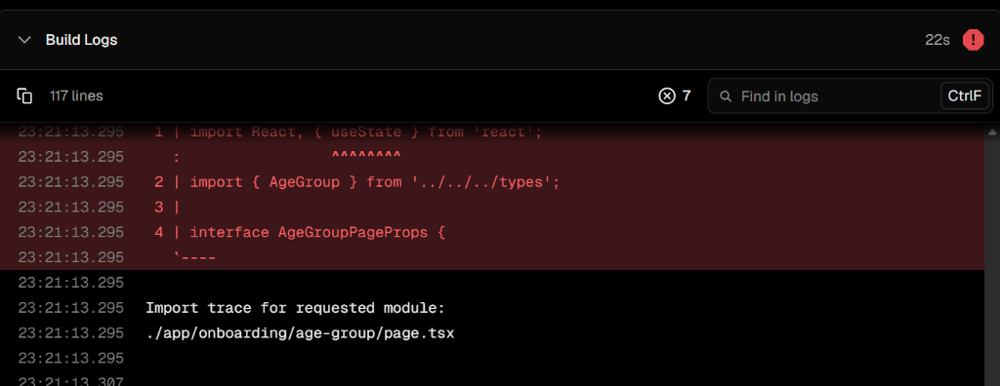
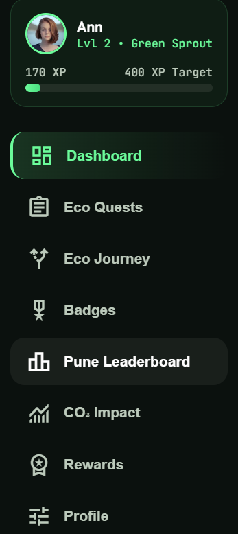
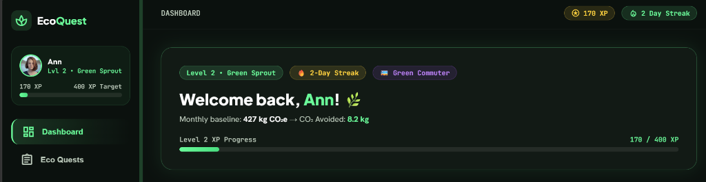
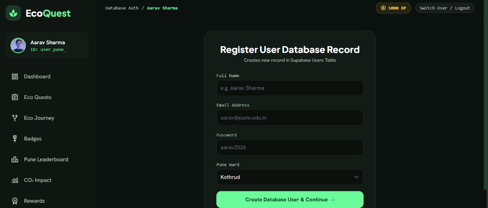

# EcoQuest — AI-Powered Gamified Carbon Tracker & Action Platform 🌿

[](http://localhost:8000)
[](http://localhost:8000)
[](http://localhost:8000)
[](docs/implementation.md)

**Measure · Understand · Personalize · Play · Verify · Reward · Compete · Reduce**

EcoQuest converts everyday real-world sustainable actions across Pune into an engaging, gamified experience. Instead of behaving like a static carbon calculator, it establishes a continuous adaptive loop powered by an **AI Personalization, Vision Verification & Anti-Cheat Engine**.

---

## 📸 Website Showcase & Screenshots

### 1. Landing & Level 1 Onboarding
Clean, modern dark-mode landing experience with zero-friction entry:



---

### 2. Citizen Dashboard & AI Hotspot Breakdown
Personalized emission analysis across 5 categories, real-time streaks, and AI weekly summaries:



---

### 3. AI Vision Object Detection & EcoGuard Geotag Verification
Interactive photo proof upload with live Pune GPS coordinates validation (`18.5204° N, 73.8567° E`) and simulated AI object detection confidence scoring:



---

### 4. Pune Wall of Champions & Real-Time Leaderboard
Live rankings of all registered citizens and administrators across Pune municipal wards:



---

## 🔁 The Core AI Feedback Loop

```text
                    USER LIFESTYLE SURVEY
                              ↓
                      DETERMINISTIC CARBON ENGINE
                              ↓
                   Monthly Baseline (e.g. 182 kg CO₂e)
                              ↓
                   ┌───────────────────────┐
                   │       AI ENGINE       │
                   └───────────┬───────────┘
                               ↓
        ┌──────────────────────┼──────────────────────┐
        ↓                      ↓                      ↓
  AI Hotspot Analyzer  Green Persona Classifier  AI Recommendations
  (Identifies top      (Classifies behavior      (Tailors quest pool
  emission category)    profile: VERDA, ECO...)   to user hotspots)
        │                      │                      │
        └──────────────────────┼──────────────────────┘
                               ↓
                     Personalized Quest Pool
                               ↓
                       "Can't Do This"
                   (AI Quest Adaptation Swap)
                               ↓
                      Proof Verification
                   (AI Vision Object Check)
                               ↓
                 EcoXP Awarded & Level Up
                               ↓
                   AI Weekly Progress Report
                               ↓
                       New User Behavior
                               ↓
                       Re-Personalization 🔄
```

---

## 🤖 Integrated AI Engine Components

EcoQuest features an 8-component AI architecture designed for real-time personalization, verification, and natural language assistance:

| AI Component | Function | Module Location |
|---|---|---|
| 🚗 **AI Hotspot Analyzer** | Analyzes monthly category footprint breakdown to isolate top emissions | `lib/carbon/hotspot.ts` |
| 🎭 **Green Persona Classifier** | Classifies users into adaptive behavior profiles independently from game level | `lib/ai/persona.ts` |
| 🎯 **AI Recommendation Engine** | Generates tailored action recommendations based on user profile payloads | `lib/ai/recommendations.ts` |
| 🔄 **AI "Can't Do This" Quest Swap** | Replaces rejected quests with 2 lower-friction personalized eco alternatives | `lib/ai/recommendations.ts` |
| 👁️ **AI Photo Vision Verification** | Simulates computer vision object detection, confidence scoring, & proof analysis | `lib/ai/vision.ts` |
| 🛡️ **AI Anti-Cheat (EcoGuard)** | Detects velocity check anomalies, duplicate SHA-256 image hashes, & GPS geofencing | `lib/verification/ecoGuard.ts` |
| 📊 **AI Weekly Sustainability Report** | Synthesizes weekly progress, XP, streak, & CO₂ avoided into natural language summaries | `lib/ai/weeklyReport.ts` |
| 💬 **Interactive Eco AI Chat Assistant** | Floating AI assistant answering queries on Pune Metro/PMPML routes, waste rules, & recipes | `lib/ai/llm.ts` |

---

## 🌟 Official Character Avatars

EcoQuest includes 6 official high-resolution character avatars:

| Character | Tagline | Focus Area | Asset Path |
|---|---|---|---|
| 🌿 **VERDA** | *"Nurture nature, inspire change."* | Urban Tree Care & Greenery | `avatars/verda.png` |
| 💜 **LUMIA** | *"Small choices, big impact."* | Waste Segregation & Circularity | `avatars/lumia.png` |
| 💧 **AQUA** | *"Every drop counts."* | Water Heating & Energy Conservation | `avatars/aqua.png` |
| ☀️ **SOLINA** | *"Powered by the sun, driven by hope."* | Renewable Energy & Solar Tech | `avatars/solina.png` |
| 👓 **ECO** | *"Live green, leave better."* | Balanced Eco Lifestyle & Audits | `avatars/eco.png` |
| 💖 **NOVA** | *"Be the change. Start today."* | Zero Plastic & Community Action | `avatars/nova.png` |

---

## 🎮 Gamification & Level Progression

Citizens progress through a 6-tier level progression:

```text
Level 1: Eco Seedling  (0 XP)       🌱
Level 2: Green Sprout  (150 XP)     🌿
Level 3: Eco Explorer  (400 XP)     🍀
Level 4: Eco Guardian  (800 XP)     🛡️
Level 5: Eco Warrior   (1400 XP)    ⚔️
Level 6: Planet Champion (2200 XP)  👑
```

### Verification Tiers
- **Level 1 — Self-Reported**: Low-risk household actions (e.g. switching off standby devices).
- **Level 2 — Smart Verification**: Medium-risk actions with location/GPS route verification.
- **Level 3 — Proof Required**: High-value actions requiring geotagged photo proof analyzed by the AI Vision Engine.

---

## 🔑 Login & Role Credentials

EcoQuest supports role-based authentication with pre-seeded accounts:

### 🔒 PMC Admin Login
- **Email**: `ann@gmail.com`
- **Password**: `Ann@2026`
- **Features**: Direct access to Admin Overview (`/admin`), User Directory (`/admin-users`), EcoGuard Audit Console (`/admin-ecoguard`), and Quest Catalog Manager (`/admin-quests`).

### 🌱 Citizen User Login
- **Email**: `aarav.sharma@pune.edu.in`
- **Password**: `aarav2026`
- **Features**: Direct access to Citizen Dashboard (`/dashboard`), Personalized Quests, Badges, Pune Ward Leaderboard, CO₂ Impact, and PMC Rewards.

---

## 📁 Repository Structure

```text
EcoQuest/
├── avatars/                      # High-resolution character avatar PNGs (verda, lumia, aqua, solina, eco, nova)
│   ├── verda.png
│   ├── lumia.png
│   ├── aqua.png
│   ├── solina.png
│   ├── eco.png
│   └── nova.png
├── docs/                         # Documentation & Specifications
│   ├── implementation.md         # 100% Completion Audit & Implementation Plan
│   └── assets/                   # Screenshots, architecture & system flow diagrams
│       ├── hero_landing.png
│       ├── dashboard_overview.png
│       ├── quest_verification_modal.png
│       └── leaderboard_view.png
├── lib/                          # Backend & AI Engine Modules
│   ├── ai/                       # AI Hotspot, Persona, Vision, Recommendations, Report, & Chat
│   │   ├── hotspot.ts
│   │   ├── persona.ts
│   │   ├── recommendations.ts
│   │   ├── vision.ts
│   │   ├── weeklyReport.ts
│   │   └── llm.ts
│   ├── carbon/                   # Carbon calculator & emission factor engine
│   │   ├── calculator.ts
│   │   ├── engine.ts
│   │   └── hotspot.ts
│   ├── verification/             # EcoGuard Anti-Cheat & CV simulation
│   │   └── ecoGuard.ts
│   ├── gamification/             # XP, level tiers, & leaderboard logic
│   └── supabase/                 # Supabase DB Auth & schema definitions
├── app/                          # Next.js Application Route Pages
├── components/                   # Reusable UI Components
├── data/                         # Quest, badge, reward, & emission datasets
├── index.html                    # 100% Self-contained Single-Page Application
├── server.ps1                    # Local PowerShell HTTP Web Server
└── README.md                     # Project Overview & Visual Showcase
```

---

## 🚀 How to Run Locally

### Option 1: Local HTTP Web Server (Recommended)
Run the included PowerShell server script from the project root:

```powershell
powershell -ExecutionPolicy Bypass -File server.ps1
```
Then open your browser and navigate to: **`http://localhost:8000`**

### Option 2: Direct File Launch
Simply double-click or open `index.html` directly in any modern web browser!

---

## ☁️ Deployment Options

EcoQuest includes configuration for free, 1-click deployment across multiple platforms:

| Platform | Deployment Method | Notes |
|---|---|---|
| **GitHub Pages** | Settings ➔ Pages ➔ Deploy from `main` | Zero-config (`404.html` + `.nojekyll` included) |
| **Netlify** | Import `Ann-Artist/EcoQuest` | Clean SPA rewrites via `_redirects` |
| **Render** | Create Static Site from GitHub repo | Automatic global CDN |
| **Vercel** | Import `Ann-Artist/EcoQuest` | Native single-page routing via `vercel.json` |

---

**EcoQuest — Play Green. Live Better.** 🌍
